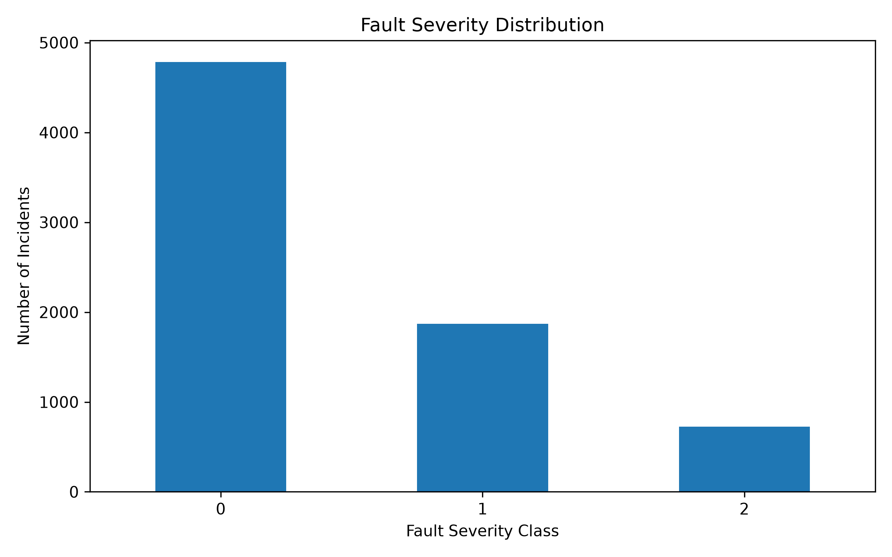
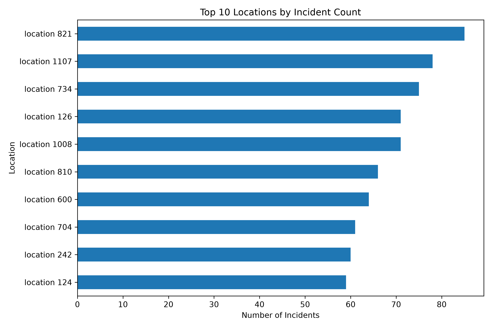
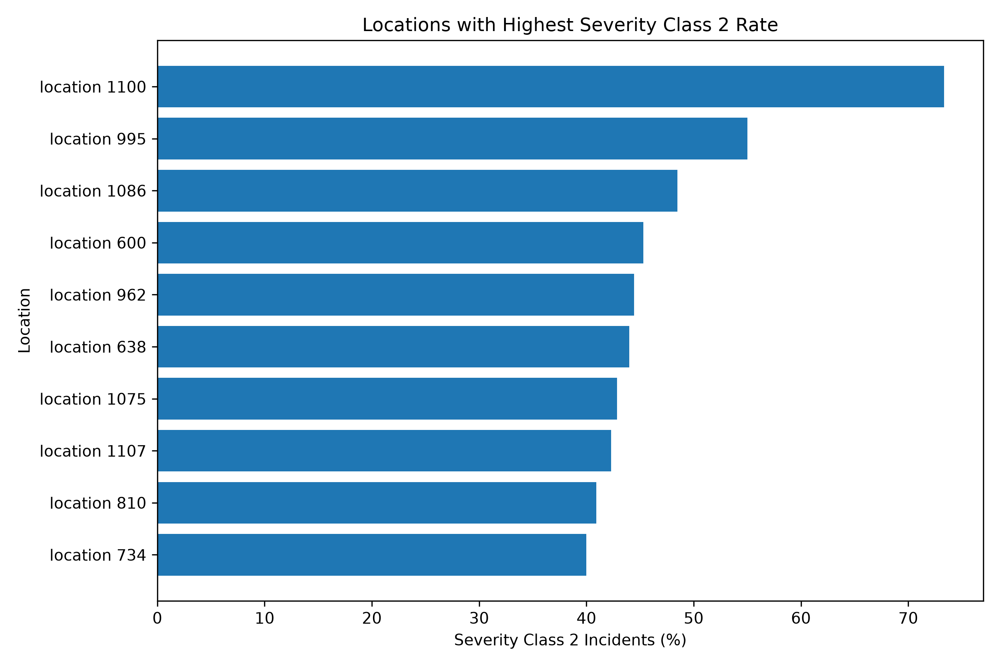
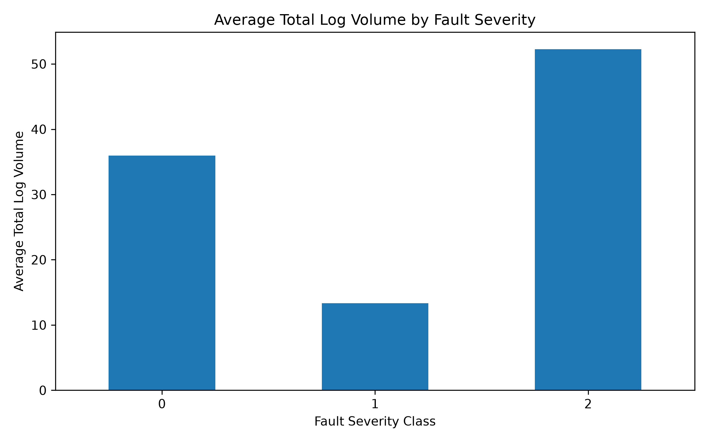
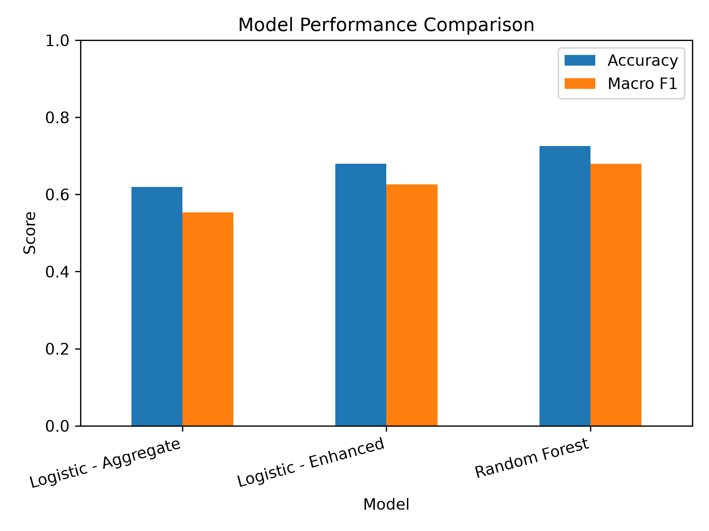
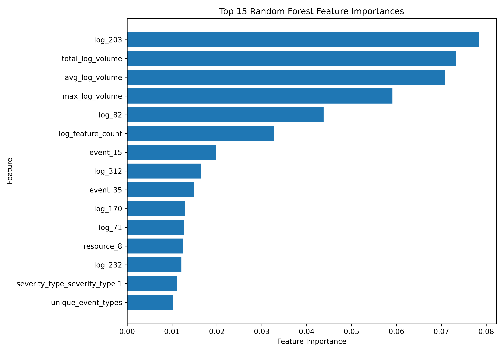

# Telecom Incident Analysis & Fault Severity Prediction

An end-to-end telecom network incident analytics and machine learning project using **Python, SQL, SQLite, Pandas, Scikit-learn, and Matplotlib**.

The project analyzes operational network-event data to identify incident patterns, high-risk locations, log activity, and factors associated with fault severity. It then builds machine-learning models to predict incident severity.

---

## Project Objectives

The project demonstrates how telecom operational data can be transformed into actionable reliability insights.

The main objectives are to:

- Analyze the distribution and characteristics of network incidents.
- Identify locations with high incident volumes and high severe-fault rates.
- Investigate relationships between log activity and fault severity.
- Combine multiple operational datasets using SQL and Python.
- Engineer predictive features from events, logs, resources, and severity information.
- Build and compare machine-learning models for fault-severity prediction.
- Identify the operational features most associated with severe incidents.
- Present findings through reproducible analysis and visualizations.

---

## Dataset

This project uses the **Telstra Network Disruptions** dataset originally published as a Kaggle competition.

The data represents network incidents using several related tables:

- `train.csv` — incident ID, location and target fault severity.
- `event_type.csv` — event types associated with incidents.
- `log_feature.csv` — log features and their volumes.
- `resource_type.csv` — resource types associated with incidents.
- `severity_type.csv` — severity categories associated with incidents.

The target variable is `fault_severity`:

- `0` — no fault
- `1` — only a few faults
- `2` — many faults

The raw Kaggle competition files are **not included in this repository**. They must be obtained separately from the Telstra Network Disruptions competition on Kaggle and placed in `data/raw/`.

---

## Project Architecture

```text
Raw Telecom Data
        |
        v
Data Exploration
        |
        v
SQLite Database
        |
        v
SQL Incident Analysis
        |
        v
Feature Engineering
        |
        v
Baseline Model
        |
        v
Enhanced Feature Engineering
        |
        v
Enhanced Logistic Regression
        |
        v
Random Forest
        |
        v
Feature Importance Analysis
        |
        v
Operational Insights & Visualizations
```

---

## Repository Structure

```text
telecom-incident-analysis/
|
|-- data/
|   |-- raw/                    # Kaggle source data (not committed)
|   `-- processed/              # Generated datasets (not committed)
|
|-- reports/
|   `-- figures/
|       |-- fault_severity_distribution.png
|       |-- feature_importance.png
|       |-- log_volume_by_severity.png
|       |-- model_comparison.png
|       |-- severity_2_rate_by_location.png
|       `-- top_incident_locations.png
|
|-- sql/
|   `-- 01_incident_analysis.sql
|
|-- src/
|   |-- 01_data_exploration.py
|   |-- 02_create_database.py
|   |-- 03_run_sql_analysis.py
|   |-- 04_feature_analysis.py
|   |-- 05_baseline_model.py
|   |-- 06_enhanced_features.py
|   |-- 07_enhanced_model.py
|   |-- 08_random_forest_model.py
|   |-- 09_feature_importance.py
|   `-- 10_visualizations.py
|
|-- .gitignore
|-- requirements.txt
`-- README.md
```

---

## Data Exploration

The training dataset contains:

- **7,381 incidents**
- **929 unique locations**
- No missing values
- No duplicate training rows

### Fault Severity Distribution

| Fault Severity | Incidents | Percentage |
|---|---:|---:|
| 0 | 4,784 | 64.82% |
| 1 | 1,871 | 25.35% |
| 2 | 726 | 9.84% |

The target is therefore **imbalanced**, with severity class 2 representing fewer than 10% of incidents.



---

## SQL Incident Analysis

Operational analysis was performed using **SQLite and SQL**.

### Highest Incident-Volume Locations

The highest-volume locations included:

| Location | Incident Count |
|---|---:|
| location 821 | 85 |
| location 1107 | 78 |
| location 734 | 75 |
| location 126 | 71 |
| location 1008 | 71 |



### Severe Incident Concentration

Looking only at severity class 2 revealed a different operational risk picture.

For example:

**location 1100**

- Total incidents: 45
- Severity 2 incidents: 33
- Severity 2 rate: **73.33%**

By comparison:

**location 821**

- Total incidents: 85
- Severity 2 incidents: 28

This illustrates why incident volume alone is not sufficient for reliability prioritization. A lower-volume location may represent substantially greater operational risk when the severity distribution is considered.



---

## Log Activity and Fault Severity

Aggregating log activity revealed substantial differences between severity classes.

| Severity | Avg Features | Avg Total Log Volume | Avg Log Volume | Avg Max Log Volume |
|---|---:|---:|---:|---:|
| 0 | 3.26 | 35.94 | 9.88 | 15.63 |
| 1 | 3.03 | 13.36 | 4.13 | 7.21 |
| 2 | **3.58** | **52.26** | **14.17** | **29.42** |

Severity class 2 incidents showed the highest average total log volume, average log volume, and maximum log volume.

This indicates that log activity contains useful predictive information about incident severity.



---

## Feature Engineering

The first engineered dataset combined incident-level operational metrics such as:

- Log feature count
- Total log volume
- Average log volume
- Maximum log volume
- Event count
- Unique event types
- Resource count
- Unique resource types
- Severity type

This produced:

**7,381 rows × 12 columns**

A second feature-engineering stage expanded categorical operational events, resources, and log features into machine-learning features.

The enhanced dataset contained:

**7,381 incidents × 461 columns**

with **459 predictive features**.

---

## Machine Learning

Three models were evaluated.

### Model Performance

| Model | Accuracy | Macro F1 |
|---|---:|---:|
| Baseline Logistic Regression | 0.619 | 0.553 |
| Enhanced Logistic Regression | 0.680 | 0.626 |
| **Random Forest** | **0.726** | **0.680** |



The progressive improvement demonstrates the impact of richer feature engineering and nonlinear modeling.

---

## Random Forest Results

The Random Forest produced the strongest overall performance.

### Classification Results

| Class | Precision | Recall | F1 |
|---|---:|---:|---:|
| Severity 0 | 0.882 | 0.743 | 0.807 |
| Severity 1 | 0.540 | 0.661 | 0.595 |
| Severity 2 | 0.538 | **0.786** | **0.639** |

Overall:

- **Accuracy:** 72.6%
- **Macro F1:** 0.680
- **Severity-2 recall:** 78.6%

The severity-2 recall is particularly important operationally because the model successfully identifies a substantial proportion of the highest-severity incidents.

---

## Feature Importance

Random Forest feature importance identified several influential predictors.

Top features included:

| Feature | Importance |
|---|---:|
| log feature 203 | 0.0784 |
| total log volume | 0.0733 |
| average log volume | 0.0709 |
| maximum log volume | 0.0591 |
| log feature 82 | 0.0438 |
| log feature count | 0.0328 |
| event type 15 | 0.0199 |



The results reinforce the importance of **log behavior and log volume** in distinguishing fault-severity levels.

---

## Operational Insights

Several useful reliability insights emerged from the analysis.

**1. Incident frequency and incident risk are different measures.**

The locations generating the most incidents are not necessarily the locations with the highest proportion of severe incidents.

**2. Severity class 2 incidents exhibit stronger log activity.**

Higher total, average, and maximum log volumes are associated with the highest-severity class.

**3. Individual log features contain strong predictive information.**

Specific log features ranked above many aggregate metrics in Random Forest feature importance.

**4. Feature engineering materially improved predictive performance.**

Accuracy increased from **61.9% to 72.6%**, while Macro F1 increased from **0.553 to 0.680**.

**5. Operational prioritization should combine frequency, severity and telemetry behavior.**

A reliability team could use these signals to identify locations and incident patterns requiring proactive investigation.

---

## Technologies Used

- Python
- Pandas
- NumPy
- Scikit-learn
- SQL
- SQLite
- Matplotlib
- Git
- GitHub
- VS Code

---

## Running the Project

### 1. Clone the repository

```bash
git clone https://github.com/schabaya/telecom-incident-analysis.git
cd telecom-incident-analysis
```

### 2. Create a virtual environment

```bash
python -m venv .venv
```

### 3. Activate the environment

Windows PowerShell:

```powershell
.\.venv\Scripts\Activate.ps1
```

### 4. Install dependencies

```bash
python -m pip install -r requirements.txt
```

### 5. Add the dataset

Place the required Kaggle CSV files inside:

```text
data/raw/
```

### 6. Run the pipeline

```bash
python src/01_data_exploration.py
python src/02_create_database.py
python src/03_run_sql_analysis.py
python src/04_feature_analysis.py
python src/05_baseline_model.py
python src/06_enhanced_features.py
python src/07_enhanced_model.py
python src/08_random_forest_model.py
python src/09_feature_importance.py
python src/10_visualizations.py
```

---

## Potential Future Improvements

Future development could include:

- Gradient boosting models such as XGBoost or LightGBM
- Hyperparameter optimization
- Cross-validation
- Precision-recall and ROC analysis
- Model persistence and inference pipeline
- REST API deployment
- Docker containerization
- Automated testing
- CI/CD pipeline
- Interactive Power BI or Streamlit operational dashboard
- Model monitoring and drift detection

---

## Conclusion

This project demonstrates an end-to-end workflow for converting telecom operational data into reliability insights and predictive models.

It combines:

**data exploration → SQL analytics → feature engineering → machine learning → model evaluation → operational interpretation → visualization**

The final Random Forest model achieved **72.6% accuracy**, **0.680 Macro F1**, and **78.6% recall for severity class 2**, demonstrating how network events, resource information and log telemetry can be used to identify higher-severity incident patterns.